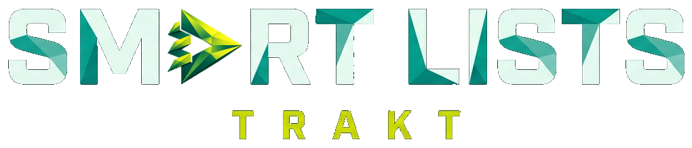
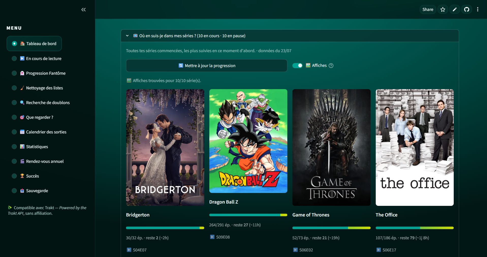
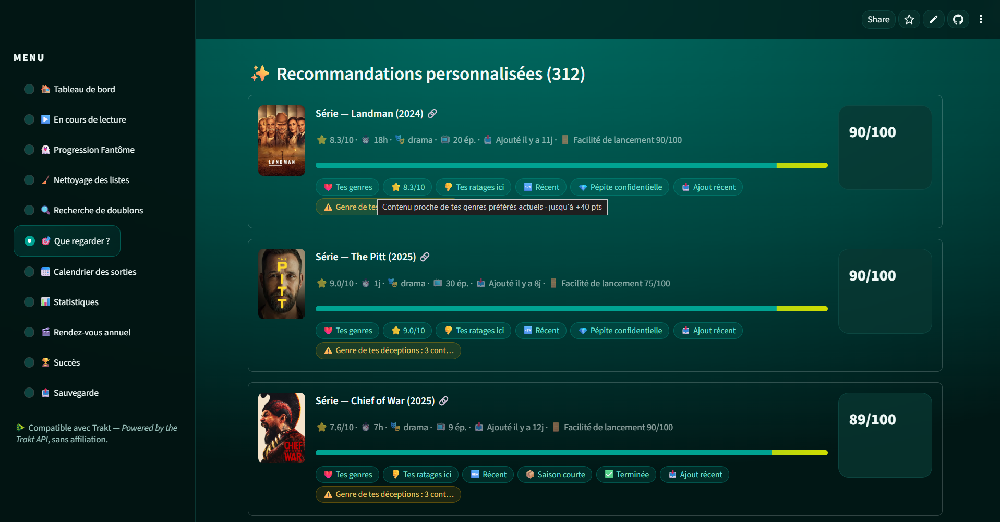

<div align="center">



**Range tes listes Trakt, retrouve tes progressions fantômes, et sache ENFIN quoi regarder ce soir.**

[](https://trakt-smart-lists.streamlit.app/)
[](https://www.python.org/)
[](https://streamlit.io/)
[](https://trakt.docs.apiary.io/)

*EN summary: a Streamlit web app that cross-references your Trakt history with your lists, cleans them up, and recommends what to watch next with a transparent, personal score. French UI.*

</div>

---

> 🎯 **Pour qui ?** Cette application est pensée d'abord pour les **utilisateurs FREE de Trakt**. Les membres **VIP** disposent déjà de statistiques et de suivi avancés sur trakt.tv (souvent plus poussés encore) : la plus-value de cet outil sera moindre pour eux.

## 🤔 Le problème

Tu utilises Trakt depuis des années. Ta watchlist est pleine, tu as réparti tes envies dans plusieurs listes, tu ne sais plus :

- ce que tu as **déjà vu** qui traîne encore dans tes listes ;
- quels contenus sont **en double** d'une liste à l'autre ;
- où sont passés ces films « repris plus tard » bloqués dans *Continuer à regarder* (les **fantômes** 👻 — les mêmes qui polluent ton widget « En cours » dans Kodi) ;
- et surtout… **quoi regarder ce soir** sans scroller 40 minutes.

Trakt Smart Lists répond à tout ça, en une analyse.

## ✨ Fonctionnalités

| Page | Ce qu'elle fait |
|---|---|
| 🏠 **Tableau de bord** | Vue d'ensemble, digest de ta semaine, lecture en cours, état du nettoyage, **⏱️ ton rythme** (récap du mois, ép./semaine, compteurs à vie, **date de fin projetée** 📅), **📺 ta progression dans TOUTES tes séries** (%, temps vu/restant, **prochain épisode SxxEyy**, affiches TMDB optionnelles, séries à l'abandon 💤, derniers visionnages 🕘). Blocs d'info **repliés par défaut** : info proposée, jamais imposée |
| ▶️ **En cours de lecture** | Ce que tu es EN TRAIN de regarder : progression réelle, temps écoulé/restant, heure de fin estimée |
| 👻 **Progression fantôme** | Les entrées bloquées dans « Continuer à regarder » — supprime-les proprement, ou finis-les ce soir |
| 🧹 **Nettoyage des listes** | Retire les contenus déjà vus de tes listes, avec garde-fou intelligent : distinction **ajouté avant le visionnage** (= à retirer) vs **ajouté après** (= tu veux le revoir, on le garde) |
| 🔍 **Doublons** | Le même contenu dans plusieurs listes ? Retire les copies en un clic |
| 🎯 **Que regarder ?** | Score personnel **100 % explicable** (/100 + indice de friction 🚪), 21 presets d'humeur, roulette pondérée **+ roulette 🧭 découverte** (hors zone de confort), pastilles à infobulles |
| 📅 **Calendrier** | Les prochaines sorties de TES listes + ton calendrier perso d'épisodes (7/14/30 jours) |
| 📊 **Statistiques** | Heatmap façon GitHub, évolution de tes goûts, ADN cinéphile, marathons, rythmes de visionnage — filtres combinables (période, genre, type) |
| 🎬 **Rendez-vous annuel** | Ton « Wrapped » perso + image PNG partageable générée à la volée |
| 🏆 **Succès** | 50+ badges à débloquer (marathons, streaks 🔥, rewatch master ♾️…) |
| 📤 **Sauvegarde** | Export/import JSON complet de tes données d'analyse |

### 🎯 Le score « Que regarder ? » : transparent et personnel

Pas de boîte noire. Chaque recommandation affiche **pourquoi** elle est là, en points :

- ❤️ Tes genres (pondérés par **récence** — tes goûts d'il y a 2 ans pèsent moins)
- 🫶 Les genres que TOI tu notes haut… et **👎 tes propres ratages** (genre déjà noté ≤ 3/10 chez toi → léger doute, jamais éliminatoire)
- ⏱️ Ta durée idéale, calculée sur TES films réellement regardés
- 🌍 Tes pays de cinéma de prédilection · 🌱 Jeune série · 🏁 Presque finie
- ⏳ « Déjà commencée, il te reste X ép. » · ▶️ « En pause chez toi »
- 🔄 Anti-saturation **douce** (suggère de varier, ne pénalise jamais)
- 🌙 Contenus courts favorisés après 22 h
- 🚪 **Indice de friction** : la « facilité de lancement » ce soir, à côté du score

Et pour choisir en 1 clic : **21 presets** (⚡ Rapide · 🍿 Soirée cinéma · 📺 Binge express · 🎯 Presque finies · 💎 Pépites confidentielles · 😄 Rire · 😱 Frissons · 🌍 Cinéma du monde · 🧭 Hors zone de confort…).

## ⚡ Pourquoi c'est rapide

- **Historique téléchargé en parallèle** (5 flux, retry automatique si Trakt limite)
- **Synchronisation différentielle** `start_at` : aux visites suivantes, seules les **nouvelles** vues sont récupérées
- **Cache serveur** de l'historique → reconnexion quasi instantanée
- **Progressions des séries** via l'endpoint officiel `progress/watched` : affichage 100 % depuis le cache disque (0 appel), mise à jour **DELTA** sur simple bouton
- « Que regarder ? » et le Calendrier puisent dans les données **déjà chargées par l'analyse** : 0 appel API de plus
- Aucun appel API au rendu des pages ; les rapports (Excel, PNG) ne se génèrent **qu'au clic** ; les affiches TMDB ne se chargent **que si tu les actives**

## 📸 Captures d'écran

<!--
📸 NOTE MAINTENEUR — comment ajouter les captures :
1. À la racine du repo : Add file → Upload files, crée le dossier docs/ et dépose tes PNG
   (dashboard.png, series.png, quoi_regarder.png).
2. Supprime ensuite ce bloc commentaire et dé-commente les lignes ci-dessous :
<p align="center"></p>
<p align="center"></p>
<p align="center"></p>
-->

## 🚀 Utiliser l'app

👉 **[trakt-smart-lists.streamlit.app](https://trakt-smart-lists.streamlit.app/)** — connecte ton compte Trakt (code affiché + QR code), lance l'analyse, c'est parti.

> ⚠️ L'app **lit et écrit sur ton compte Trakt** uniquement quand tu cliques sur un bouton de suppression (avec confirmation à chaque fois). Elle ne partage rien avec personne.

## 🛠️ Lancer en local

```bash
git clone https://github.com/Minijoe01/Trakt-Smart-Lists.git
cd Trakt-Smart-Lists
pip install -r requirements.txt
```

Crée une application Trakt sur **[trakt.tv/oauth/applications](https://trakt.tv/oauth/applications)** (redirect URI : `urn:ietf:wg:oauth:2.0:oob`), puis renseigne `.streamlit/secrets.toml` :

```toml
TRAKT_CLIENT_ID = "ton_client_id"
TRAKT_CLIENT_SECRET = "ton_client_secret"
TMDB_API_KEY = "optionnel — pour les affiches de films/séries (clé v3 courte OU jeton v4 long, les 2 marchent)"
```

```bash
streamlit run app.py
```

## ☁️ Déployer ta propre instance (Streamlit Cloud)

1. Fork ce repo sur ton compte GitHub.
2. Sur [share.streamlit.io](https://share.streamlit.io) : **New app** → ton repo, branche `main`, fichier `app.py`.
3. Dans **Settings → Secrets**, colle le même bloc TOML que ci-dessus.
4. Deploy. 🎉

Le dossier `fonts/` (polices DejaVu) garantit les accents sur l'image Wrapped PNG ; `static/fonts/` embarque la police **Manrope** de l'en-tête (`enableStaticServing = true` dans `.streamlit/config.toml`) ; `logo.png` à la racine sert de favicon, `static/wordmark.png` d'en-tête.

## 🔒 Vie privée

- Aucune base de données, aucun compte à créer : l'authentification se fait directement entre toi et Trakt (OAuth device flow).
- Les jetons ne quittent jamais le serveur Streamlit / ton navigateur, et ne sont **jamais** inclus dans les exports.
- L'historique est mis en cache côté serveur (cloisonné par utilisateur, fichier temporaire) uniquement pour accélérer tes visites suivantes.
- Les suppressions sur Trakt ne se font **que sur action explicite + confirmation**, élément par élément ou sélection.

## 💬 Communauté

- 🐛 **Un bug, une idée ?** → [Ouvre une issue](https://github.com/Minijoe01/Trakt-Smart-Lists/issues)
- 💡 Discussions & entraide → onglet **Discussions** du repo
- 🤝 Tu veux contribuer ? Fork → branche → Pull Request. Les PR sont lues et triées par le mainteneur.

## 🙏 Attributions & remerciements

- Données : **[Trakt](https://trakt.tv)** ([API v2](https://trakt.docs.apiary.io/)) — *This product uses the Trakt API but is not endorsed or certified by Trakt.*
- Affiches : **[TMDB](https://www.themoviedb.org/)** — *This product uses the TMDB API but is not endorsed or certified by TMDB.*
- Construit avec [Streamlit](https://streamlit.io), [streamlit-echarts](https://github.com/andfanilo/streamlit-echarts), la police [Manrope](https://github.com/sharanda/manrope) (OFL) et beaucoup d'amour pour le cinéma et les séries.

---

<div align="center">
<sub>Fait avec 🍿 pour la communauté des Alkodiques et tous les fans de Trakt.</sub>
</div>
